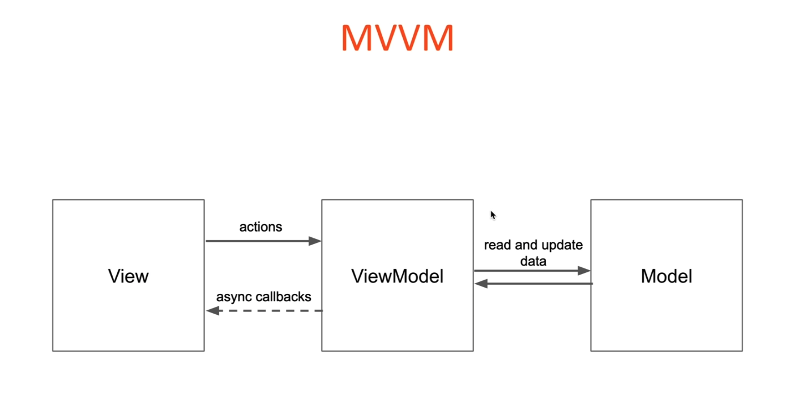

# Clean Architecture Overview

### Theory

- Introduce the concepts of clean architecture
- Talk about the layers involved
- SOLID principles
- MVVM Architecture

### Practice

- Build a note taking app
- Structure it in 2 modules to enforce architecture
- Clean architecture with MVVM
- Room, Navigation, Dependency Injection

# What is Clean Architecture?

### Clean Architecture


- A way to organize a project to achieve maintainability and scalability
- One concern per component
- Structured in layers of dependency
- Implementation layers depend on abstract layers
- Is not specific to mobile development
- Strict architecture - hard to make mistakes
- Business logic is encapsulated, easy to use and test
- Enforcement of dependencies through encapsulation
- Allows for parallel development
- Highly scalable
- Easy to understand and maintain
- Testing is facilitated

### Entities

- Domain Objects
- **Foundational Business Logic**
- POJOS (Plain Old Java Object)

### Use cases

- Actions that can be taken on the entities
- Depend on entities
- **Business logic, plain code**
- **No other dependencies**
- A use case doesn't know how the result is going to be used

### Controllers, Presenters, Adapters

- Interfaces
- Retrieve data from various sources
- Present data in a specific format (e.g. XML, JSON)
- Depend on lower level layers

### Infrastructure

- How the data is interpreted and presented
- Most volatile layer, likely to change
- Interacts with interfaces to retrieve data
- UI, Frameworks, devices etc

# SOLID Principles

### Single Responsibility

- A class should only have one job
- One reason to change
- If there are two reasons to change, it should be split into two different classes

### Open-Closed

- Open for extension, closed for modification
- If new functionality needs to be added, it should be added to an extension of the class
- Abstract away stable functionality
- Put volatile functionality in extension classes

### Liskov Substitution

- Low level classes can be substituted without affecting higher levels
- Achieved using abstract classes and interfaces

### Interface segregation

- Use interface to advertise functionality
- Many specific interfaces are better than one generic interface
- An interface only exposed the methods that the dependent class needs not more

### Dependency Inversion

- Concrete classes depend on abstract classes not the other way around
- Volatile functionality depends stable functionality
- Framework specific functionality depends on business logic

# Project Structure


# MVVM


### Why MVVM?

- Supported by Google, part of Android Jetpack
- ViewModel integrates well with the Activity/Fragment lifecycle
- LiveData provides async communication with the View

# V.1.0 Gradle Configuration

### Guideline

```kotlin
Add this in your project level build.gradle file

Under buildscript

    ext.coroutines_version = "1.3.0"
    ext.room_version = "2.2.2"
    ext.glide_version = "4.8.0"
    ext.nav_version = "2.1.0"
    ext.daggerVersion = '2.14.1'

Under dependencies

    classpath "androidx.navigation:navigation-safe-args-gradle-plugin:$nav_version"

Add this in your app module build.gradle file

At the top

    apply plugin: 'kotlin-kapt'
    apply plugin: "androidx.navigation.safeargs.kotlin"

Under dependencies

    implementation project(':core')

    implementation "androidx.recyclerview:recyclerview:1.1.0"

    implementation "androidx.navigation:navigation-fragment-ktx:$nav_version"
    implementation "androidx.navigation:navigation-ui-ktx:$nav_version"

    implementation 'android.arch.lifecycle:extensions:1.1.1'

    implementation "org.jetbrains.kotlinx:kotlinx-coroutines-core:$coroutines_version"
    implementation "org.jetbrains.kotlinx:kotlinx-coroutines-android:$coroutines_version"

    implementation "androidx.room:room-runtime:$room_version"
    implementation 'androidx.legacy:legacy-support-v4:1.0.0'
    kapt "androidx.room:room-compiler:$room_version"
    implementation "androidx.room:room-ktx:$room_version"

    implementation "com.google.dagger:dagger:$daggerVersion"
    implementation "com.google.dagger:dagger-android-support:$daggerVersion"
    kapt "com.google.dagger:dagger-compiler:$daggerVersion"
    kapt "com.google.dagger:dagger-android-processor:$daggerVersion"

Add this in your core module build.gradle file

At the top

    apply plugin: 'kotlin'

Under dependencies

    implementation "org.jetbrains.kotlin:kotlin-stdlib-jdk8:$kotlin_version"
```

### Create Module

- This `core` module will take care of data


### Core Module Data Layer Structure

- /data
- /respository
- /usecase


### Make a structure of the project


### App

- /framework
- /presentation (it holds activity & fragment)

### Core

- /data
- /repository
- /usecase

### Add dependencies to Project Level Gradle

```kotlin
// Top-level build file where you can add configuration options common to all sub-projects/modules.
buildscript {
    ext.kotlin_version = "1.4.32"
    ext.coroutines_version = "1.3.0"
    ext.room_version = "2.2.2"
    ext.glide_version = "4.8.0"
    ext.nav_version = "2.1.0"
    ext.daggerVersion = '2.14.1'
    repositories {
        google()
        jcenter()
    }
    dependencies {
        classpath "com.android.tools.build:gradle:4.1.3"
        classpath "org.jetbrains.kotlin:kotlin-gradle-plugin:$kotlin_version"
        classpath "androidx.navigation:navigation-safe-args-gradle-plugin:$nav_version"
        // NOTE: Do not place your application dependencies here; they belong
        // in the individual module build.gradle files
    }
}

allprojects {
    repositories {
        google()
        jcenter()
    }
}

task clean(type: Delete) {
    delete rootProject.buildDir
}
```

### Add dependencies to App Level Gradle

```kotlin
plugins {
    id 'com.android.application'
    id 'kotlin-android'
    id 'kotlin-kapt'
    id 'androidx.navigation.safeargs.kotlin'
}

android {
    compileSdkVersion 30
    buildToolsVersion "30.0.3"

    defaultConfig {
        applicationId "com.example.cleanarchitectureexampleapp"
        minSdkVersion 21
        targetSdkVersion 30
        versionCode 1
        versionName "1.0"

        testInstrumentationRunner "androidx.test.runner.AndroidJUnitRunner"
    }

    buildTypes {
        release {
            minifyEnabled false
            proguardFiles getDefaultProguardFile('proguard-android-optimize.txt'), 'proguard-rules.pro'
        }
    }
    compileOptions {
        sourceCompatibility JavaVersion.VERSION_1_8
        targetCompatibility JavaVersion.VERSION_1_8
    }
    kotlinOptions {
        jvmTarget = '1.8'
    }
}

dependencies {
    implementation project(":core")

    implementation "org.jetbrains.kotlin:kotlin-stdlib:$kotlin_version"
//    implementation "org.jetbrains.kotlin:kotlin-stdlib-jdk8:$kotlin_version"
    implementation 'androidx.core:core-ktx:1.6.0'
    implementation 'androidx.appcompat:appcompat:1.3.1'
    implementation 'com.google.android.material:material:1.4.0'
    implementation 'androidx.constraintlayout:constraintlayout:2.1.0'

    implementation "androidx.recyclerview:recyclerview:1.1.0"

    implementation "androidx.navigation:navigation-fragment-ktx:$nav_version"
    implementation "androidx.navigation:navigation-ui-ktx:$nav_version"

    implementation 'android.arch.lifecycle:extensions:1.1.1'

    implementation "org.jetbrains.kotlinx:kotlinx-coroutines-core:$coroutines_version"
    implementation "org.jetbrains.kotlinx:kotlinx-coroutines-android:$coroutines_version"

    implementation "androidx.room:room-runtime:$room_version"
    implementation 'androidx.legacy:legacy-support-v4:1.0.0'
    kapt "androidx.room:room-compiler:$room_version"
    implementation "androidx.room:room-ktx:$room_version"

    implementation "com.google.dagger:dagger:$daggerVersion"
    implementation "com.google.dagger:dagger-android-support:$daggerVersion"
    kapt "com.google.dagger:dagger-compiler:$daggerVersion"
    kapt "com.google.dagger:dagger-android-processor:$daggerVersion"

    testImplementation 'junit:junit:4.+'
    androidTestImplementation 'androidx.test.ext:junit:1.1.3'
    androidTestImplementation 'androidx.test.espresso:espresso-core:3.4.0'
}
```

### Add dependencies to Core

```kotlin
plugins {
    id 'java-library'
    id 'kotlin'
}

dependencies {
    implementation fileTree(dir: 'libs', includes: ['*.jar'])
    implementation "org.jetbrains.kotlin:kotlin-stdlib-jdk8:$kotlin_version"
}

java {
    sourceCompatibility = JavaVersion.VERSION_1_7
    targetCompatibility = JavaVersion.VERSION_1_7
}
```

# v.2.0 Data Layer

### Data Entities

- /data/Note.kt

```kotlin
package com.example.core.data

//POJO Object, Plain Old Java Object
data class Note(
    var title: String,
    var content: String,
    var creationTime: Long,
    var updateTime: Long,
    var id: Long = 0
)
```

### Repository

- /repository/NoteDataSource.kt

```kotlin
interface NoteDataSource {
    suspend fun add(note: Note)
    suspend fun get(id: Long): Note?
    suspend fun getAll(): List<Note>
    suspend fun remove(note: Note)
}
```

- /repository/NoteRepository.kt

```kotlin
class NoteRepository(private val dataSource: NoteDataSource) {
    suspend fun addNote(note: Note) = dataSource.add(note)
    suspend fun getNote(id: Long) = dataSource.get(id)
    suspend fun getAllNotes() = dataSource.getAll()
    suspend fun removeNote(note: Note) = dataSource.remove(note)
}
```

### Usecase

- /usecase/AddNote.kt

```kotlin
class AddNote(private val noteRepository: NoteRepository) {
    suspend operator fun invoke(note: Note) = noteRepository.addNote(note)
}
```

- /usecase/GetAllNotes.kt

```kotlin
class GetAllNotes(private val noteRepository: NoteRepository) {
    suspend operator fun invoke() = noteRepository.getAllNotes()
}
```

- /usecase/GetNote.kt

```kotlin
class GetNote(private val noteRepository: NoteRepository) {
    suspend operator fun invoke(id: Long) = noteRepository.getNote(id)
}
```

- /usecase/RemoveNote.kt

```kotlin
class RemoveNote(private val noteRepository: NoteRepository) {
    suspend operator fun invoke(note: Note) = noteRepository.removeNote(note)
}
```

### Data layer Complete


# v.3.0 Navigation

### Navigation

- Handles user app journey
- Removes complexity for moving from one screen to another
- Handles complex cases like
  - Bottom tabbed navigation
  - App drawers
- Generated classes

### Navigation - Benefits

- Handles fragment transactions
- Handles back and up actions
- Manage the backstack
- Argument passing
- Transition animations
- Deep linking

### Navigation - Components


- Navigation Graph
- Nav host fragment
- Nav controller

### Create Navigation


- Navigation Graph

### Create argument


### Create NavHostFragment


### Navigation Code

```kotlin
class ListFragment : Fragment() {

    override fun onCreateView(inflater: LayoutInflater, container: ViewGroup?,
                              savedInstanceState: Bundle?): View? {
        return inflater.inflate(R.layout.fragment_list, container, false)
    }

    override fun onViewCreated(view: View, savedInstanceState: Bundle?) {
        super.onViewCreated(view, savedInstanceState)
        addNote.setOnClickListener {
            goToNoteDetails()
        }
    }

    // setup navigation with our defined argument
    private fun goToNoteDetails(id: Long = 0L) {
        val action = ListFragmentDirections.actionGoToNote()
        Navigation.findNavController(notesListView).navigate(action)
    }

}
```

```kotlin
class NoteFragment : Fragment() {

    override fun onCreateView(
        inflater: LayoutInflater, container: ViewGroup?,
        savedInstanceState: Bundle?
    ): View? {
        // Inflate the layout for this fragment
        return inflater.inflate(R.layout.fragment_note, container, false)
    }

    override fun onViewCreated(view: View, savedInstanceState: Bundle?) {
        super.onViewCreated(view, savedInstanceState)
        checkButton.setOnClickListener {
            Navigation.findNavController(it).popBackStack()
        }
    }

}
```

# v.3.0 Room

### What is room?

- Abstraction layer over SQL
- Easily store objects in a database
- Generated classes
- Compile time checks

### Room - Setup

- @Entitiy
- @Dao
- @Database

### Room - Queries

- @Insert
- @Update
- @Delete
- @Query
- @RawQuery

### Database migration functionality

- Database migration functionality
- Unit testing functionality
- Database access on background thread

### Entity Setup

```kotlin
@Entity(tableName="note")
data class NoteEntity (
    val title: String,
    val content: String,

    @ColumnInfo(name = "creation_date")
    val creationTime: Long,

    @ColumnInfo(name = "update_time")
    val updateTime: Long,

    @PrimaryKey(autoGenerate = true)
    val id: Long= 0L,
) {

    companion object {
        fun fromNote(note: Note): NoteEntity = NoteEntity(note.title, note.content, note.creationTime, note.updateTime)
    }

    fun toNote(): Note = Note(title, content, creationTime, updateTime, id)

}
```

- Responsibility
  - Note ⇒ NoteEntity
  - NoteEntity ⇒ Note

### Note Dao

```kotlin
@Dao
interface NoteDao {

    @Insert(onConflict = REPLACE)
    suspend fun addNoteEntity(noteEntity: NoteEntity)

    @Query("SELECT * FROM note WHERE id = :id")
    suspend fun getNoteEntity(id: Long): NoteEntity?

    @Query("SELECT * FROM note")
    suspend fun getAllNoteEntities() : List<NoteEntity>

    @Delete
    suspend fun deleteNoteEntity(noteEntity: NoteEntity)

}
```

### DatabaseService

```kotlin
@Database(entities = [NoteEntity::class], version = 1)
abstract class DatabaseService : RoomDatabase() {

    companion object {
        private const val DATABASE_NAME = "note.db"
        private var instance: DatabaseService? = null
        private fun create(context: Context): DatabaseService =
            Room.databaseBuilder(context, DatabaseService::class.java, DATABASE_NAME)
                .fallbackToDestructiveMigration()
                .build()
        fun getInstance(context: Context): DatabaseService = (instance ?: create(context)).also { instance = it}
    }

    abstract fun noteDao(): NoteDao

}
```

### RoomNoteDataSource

```kotlin
class RoomNoteDataSource(context: Context): NoteDataSource {
    val noteDao = DatabaseService.getInstance(context).noteDao()

    override suspend fun add(note: Note) = noteDao.addNoteEntity(NoteEntity.fromNote(note))

    override suspend fun get(id: Long): Note? = noteDao.getNoteEntity(id)?.toNote()

    override suspend fun getAll(): List<Note> = noteDao.getAllNoteEntities().map { it.toNote() }

    override suspend fun remove(note: Note) = noteDao.deleteNoteEntity(NoteEntity.fromNote(note))
}
```

### Usecases

```kotlin
data class Usecases(
    val addNote: AddNote,
    val getAllNotes: GetAllNotes,
    val getNote: GetNote,
    val removeNote: RemoveNote
)
```

# v.4.0 ViewModel

### MVVM



### ViewModel

- A class that stores UI released data
- A Bridget between the model and the View
- Has a (very simplified) lifecycle
- Should not depend on the activity context
  - Can depend on the application context if necessary

### LiveData

- An observable
- Lifecycle aware
- No memory leaks
- Always up to date data
- Manages configuration changes

### Define ViewModel

```kotlin
class NoteViewModel(application: Application): AndroidViewModel(application) {

    private val coroutineScope = CoroutineScope(Dispatchers.IO)

    val repository = NoteRepository(RoomNoteDataSource(application))

    val useCases = Usecases(
        AddNote(repository),
        GetAllNotes(repository),
        GetNote(repository),
        RemoveNote(repository),
    )

    val saved = MutableLiveData<Boolean>()

    fun saveNote(note: Note) {
        coroutineScope.launch {
            useCases.addNote(note)
            saved.postValue(true)
        }
    }

}
```

### ListFragment

- ListFragment.kt

```kotlin
class ListFragment : Fragment(), ListAction {

    private val notesListAdapter = NotesListAdapter(arrayListOf(), this)
    private lateinit var viewModel: ListViewModel

    override fun onCreateView(
        inflater: LayoutInflater, container: ViewGroup?,
        savedInstanceState: Bundle?
    ): View? {
        return inflater.inflate(R.layout.fragment_list, container, false)
    }

    override fun onViewCreated(view: View, savedInstanceState: Bundle?) {
        super.onViewCreated(view, savedInstanceState)

        notesListView.apply {
            layoutManager = LinearLayoutManager(context)
            adapter = notesListAdapter
        }

        addNote.setOnClickListener { goToNoteDetails() }

        viewModel = ViewModelProviders.of(this).get(ListViewModel::class.java)

        observeViewModel()
    }

    private fun observeViewModel() {
        viewModel.notes.observe(viewLifecycleOwner, Observer {
            loadingView.visibility = View.GONE
            notesListView.visibility = View.VISIBLE
            notesListAdapter.updateNotes(it.sortedByDescending { it.updateTime })
        })
    }

    override fun onResume() {
        super.onResume()
        viewModel.getNotes()
    }

    // setup navigation with our defined argument
    private fun goToNoteDetails(id: Long = 0L) {
        val action = ListFragmentDirections.actionGoToNote(id)
        Navigation.findNavController(notesListView).navigate(action)
    }

    override fun onClick(id: Long) {
        goToNoteDetails(id)
    }

}
```

- ListViewModel.kt

```kotlin
class ListViewModel(application: Application): AndroidViewModel(application) {

    private val coroutineScope = CoroutineScope(Dispatchers.IO)

    val repository = NoteRepository(RoomNoteDataSource(application))

    val useCases = Usecases(
        AddNote(repository),
        GetAllNotes(repository),
        GetNote(repository),
        RemoveNote(repository),
    )

    val notes = MutableLiveData<List<Note>>()

    fun getNotes() {
        coroutineScope.launch {
            val noteList = useCases.getAllNotes()
            notes.postValue(noteList)
        }
    }

}
```

- ListAction.kt

```kotlin
interface ListAction {
    fun onClick(id: Long)
}
```

### NoteFragment

- NoteFragment.kt

```kotlin
class NoteFragment : Fragment() {

    private var noteId = 0L
    private lateinit var viewModel: NoteViewModel
    private var currentNote = Note("", "", 0L, 0L)

    override fun onCreate(savedInstanceState: Bundle?) {
        super.onCreate(savedInstanceState)
        setHasOptionsMenu(true)
    }

    override fun onCreateView(
        inflater: LayoutInflater, container: ViewGroup?,
        savedInstanceState: Bundle?
    ): View? {
        // Inflate the layout for this fragment
        return inflater.inflate(R.layout.fragment_note, container, false)
    }

    override fun onViewCreated(view: View, savedInstanceState: Bundle?) {
        super.onViewCreated(view, savedInstanceState)

        viewModel = ViewModelProviders.of(this).get(NoteViewModel::class.java)

        arguments?.let {
            noteId = NoteFragmentArgs.fromBundle(it).noteId
        }

        if(noteId != 0L) {
            viewModel.getNote(noteId)
        }

        checkButton.setOnClickListener {
            if(titleView.text.isNotEmpty() || contentView.text.isNotEmpty()) {
                val time = System.currentTimeMillis()
                currentNote.title = titleView.text.toString()
                currentNote.content = contentView.text.toString()
                currentNote.updateTime = time
                if(currentNote.id == 0L) {
                    currentNote.creationTime = time
                }
                viewModel.saveNote(currentNote)
            }
            Navigation.findNavController(it).popBackStack()

        }

        observeViewModel()

    }

    private fun observeViewModel() {
        viewModel.saved.observe(viewLifecycleOwner, Observer {
            if(it) {
                Toast.makeText(context, "Done!", Toast.LENGTH_SHORT).show()
                hideKeyboard()
                Navigation.findNavController(titleView).popBackStack()
            } else {
                Toast.makeText(context, "Something went wrong, please try again", Toast.LENGTH_SHORT).show()
            }
        })
        viewModel.currentNote.observe(viewLifecycleOwner, Observer {
            it?.let {
                currentNote = it
                titleView.setText(it.title, TextView.BufferType.EDITABLE)
                contentView.setText(it.content, TextView.BufferType.EDITABLE)
            }
        })
    }

    private fun hideKeyboard() {
        val imm = context?.getSystemService(INPUT_METHOD_SERVICE) as InputMethodManager
        imm.hideSoftInputFromWindow(titleView.windowToken, 0)
    }

    override fun onCreateOptionsMenu(menu: Menu, inflater: MenuInflater) {
        inflater.inflate(R.menu.note_menu, menu)
        super.onCreateOptionsMenu(menu, inflater)

    }

    override fun onOptionsItemSelected(item: MenuItem): Boolean {
        when(item.itemId) {
            R.id.deleteNote -> {
                if(context != null && noteId != 0L) {
                    AlertDialog.Builder(context)
                        .setTitle("Delete Note")
                        .setMessage("Are you sure you want to delete this note?")
                        .setPositiveButton("Yes") {dialogInterface, i -> viewModel.deleteNote(currentNote)}
                        .setNegativeButton("Cancel") {dialogInterface, i -> dialogInterface.dismiss()}
                        .create()
                        .show()
                }
            }
        }
        return true
    }

}
```

- NoteListAdapter.kt

```kotlin
class NotesListAdapter(var notes: ArrayList<Note>, val actions: ListAction): RecyclerView.Adapter<NotesListAdapter.NoteViewHolder>() {

    fun updateNotes(newNotes: List<Note>) {
        notes.clear()
        notes.addAll(newNotes)
        notifyDataSetChanged()
    }

    inner class NoteViewHolder(view: View): RecyclerView.ViewHolder(view) {

        private val layout = view.noteLayout
        private val noteTitle = view.title
        private val noteContent = view.content
        private val noteDate = view.date

        fun bind(note: Note) {
            noteTitle.text = note.title
            noteContent.text = note.content
            val sdf = SimpleDateFormat("MMM dd, HH::mm:ss")
            val resultDate = Date(note.updateTime)
            noteDate.text = "Last updated: ${sdf.format(resultDate)}"

            layout.setOnClickListener {
                actions.onClick(note.id)
            }
        }

    }

    override fun onCreateViewHolder(parent: ViewGroup, viewType: Int) = NoteViewHolder(
        LayoutInflater.from(parent.context).inflate(R.layout.item_note, parent, false)
    )

    override fun onBindViewHolder(holder: NoteViewHolder, position: Int) {
        holder.bind(notes[position])
    }

    override fun getItemCount(): Int = notes.size

}
```

- NoteViewModel

```kotlin
class NoteViewModel(application: Application): AndroidViewModel(application) {

    private val coroutineScope = CoroutineScope(Dispatchers.IO)

    val repository = NoteRepository(RoomNoteDataSource(application))

    val useCases = Usecases(
        AddNote(repository),
        GetAllNotes(repository),
        GetNote(repository),
        RemoveNote(repository),
    )

    val saved = MutableLiveData<Boolean>()
    val currentNote = MutableLiveData<Note?>()

    fun saveNote(note: Note) {
        coroutineScope.launch {
            useCases.addNote(note)
            saved.postValue(true)
        }
    }

    fun getNote(id: Long) {
        coroutineScope.launch {
            val note = useCases.getNote(id)
            currentNote.postValue(note)
        }
    }

    fun deleteNote(note: Note) {
        coroutineScope.launch {
            useCases.removeNote(note)
            saved.postValue(true)
        }
    }

}
```

# v.6.0, Dependency Injection

### Define modules

```kotlin
@Module
class ApplicationModule(val app: Application) {
    @Provides
    fun provideApp() = app

}

@Module
class RepositoryModule {

    @Provides
    fun provideRepository(app: Application) = NoteRepository(RoomNoteDataSource(app))

}

@Module
class UseCasesModule {

    @Provides
    fun getUsecases(repository: NoteRepository) = Usecases(
        AddNote(repository),
        GetAllNotes(repository),
        GetNote(repository),
        RemoveNote(repository)
    )

}
```

### Define component

```kotlin
@Component(modules = [ApplicationModule::class, RepositoryModule::class, UseCasesModule::class])
interface ViewModelComponent {
    fun inject(noteViewModel: NoteViewModel)
    fun inject(listViewModel: ListViewModel)
}
```

### Inject

```kotlin
class ListViewModel(application: Application): AndroidViewModel(application) {

    private val coroutineScope = CoroutineScope(Dispatchers.IO)

    val repository = NoteRepository(RoomNoteDataSource(application))

    @Inject
    lateinit var useCases: Usecases

    init {
        DaggerViewModelComponent.builder()
            .applicationModule(ApplicationModule(application))
            .build()
            .inject(this)
    }

    val notes = MutableLiveData<List<Note>>()

    fun getNotes() {
        coroutineScope.launch {
            val noteList = useCases.getAllNotes()
            notes.postValue(noteList)
        }
    }

}
```

```kotlin
class NoteViewModel(application: Application): AndroidViewModel(application) {

    private val coroutineScope = CoroutineScope(Dispatchers.IO)

    val repository = NoteRepository(RoomNoteDataSource(application))

    @Inject lateinit var useCases: Usecases

    val saved = MutableLiveData<Boolean>()
    val currentNote = MutableLiveData<Note?>()

    init {
        DaggerViewModelComponent.builder()
            .applicationModule(ApplicationModule((getApplication())))
            .build()
            .inject(this)
    }

    fun saveNote(note: Note) {
        coroutineScope.launch {
            useCases.addNote(note)
            saved.postValue(true)
        }
    }

    fun getNote(id: Long) {
        coroutineScope.launch {
            val note = useCases.getNote(id)
            currentNote.postValue(note)
        }
    }

    fun deleteNote(note: Note) {
        coroutineScope.launch {
            useCases.removeNote(note)
            saved.postValue(true)
        }
    }

}
```
